# Elastic Cloud Compute (EC2)

## What is EC2

1. Elastic cloud compute (CPU,RAM and disk)
2. Elastic means we can scale up and scale down any service which has elastic can be scale up and scale down

## Why EC2

1. Get rid of maintainence
2. Management and cost will go down
3. Pay as you go service

## Instance types

1. General
2. Compute optimized
3. Memory optimized
4. Storage optimized
5. Accelerated optimized

## Regions and availability

Has data centers across the globe
We can request aws give me ec2 at particular region
Inside each region we have multiple availability zone

### Create AWS EC2 instance

1. Login to AWS console and search for EC2 , You will find UI as below
   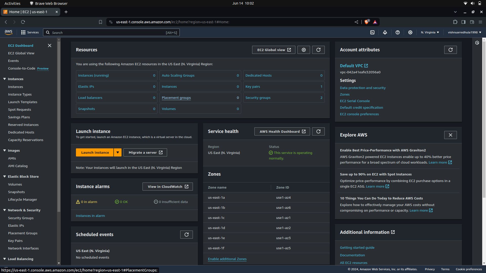
2. Click on the Launch instance to spin up a new ec2 VM , After clicking on launch instance we can see something like this on screen
   
3. Here we need to add details of name of the VM and select the VM Os and select only free tier for now
   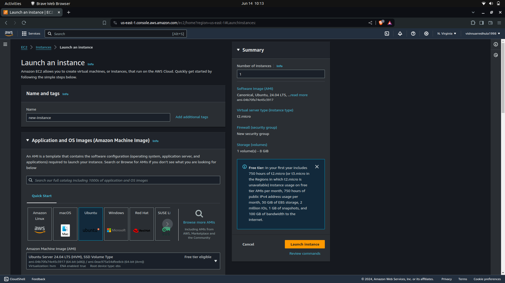
4. We can select instance type which can also be free tier eligible and key value pair which is the way (pk private key (pem) file) to access the VM through the terminal or any other means. Click on the create new key pair to create a new pair , give it a new name and create it should be (pem) and create it will be automatically downloaded to our system
   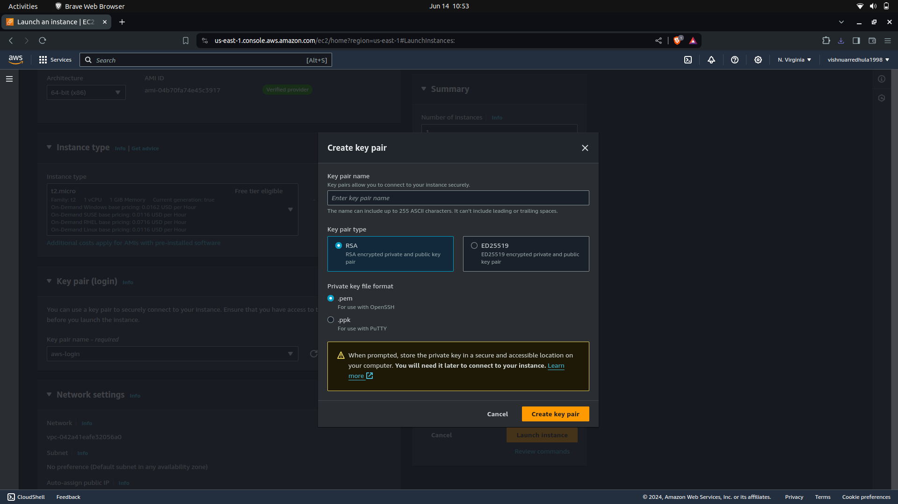
5. The network setting tab we are not going to touch it for now, For a normal ec2 we need not to touch it.
   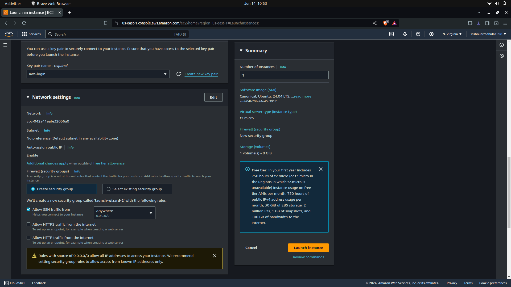
6. Finally we are having configuration for storage which we can tweak.
   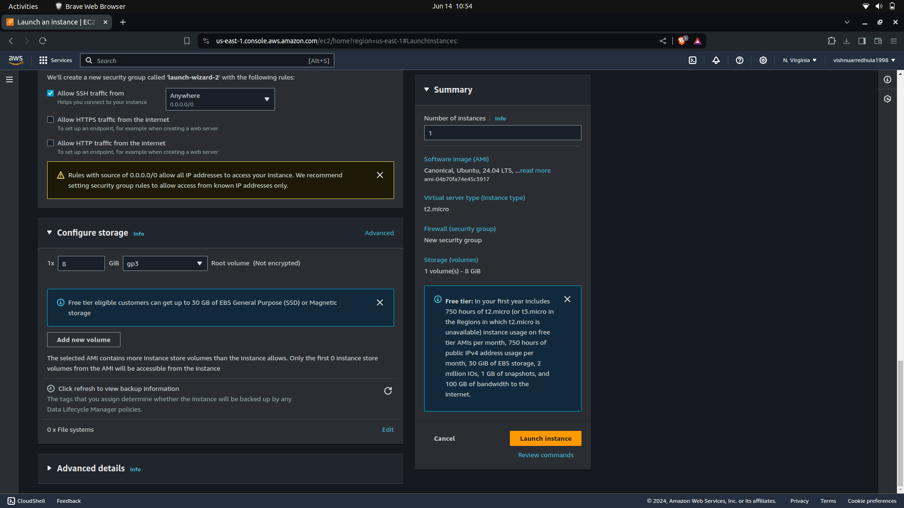

> Note : We have restriction for using free tier ec2 as below

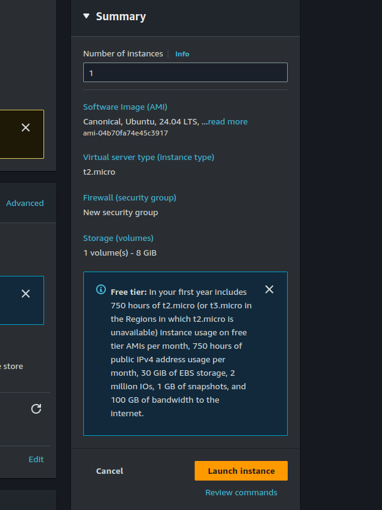

Finally we can lanch the instance

7. By clicking the instances tab we can see all the instance that are present / running as below
   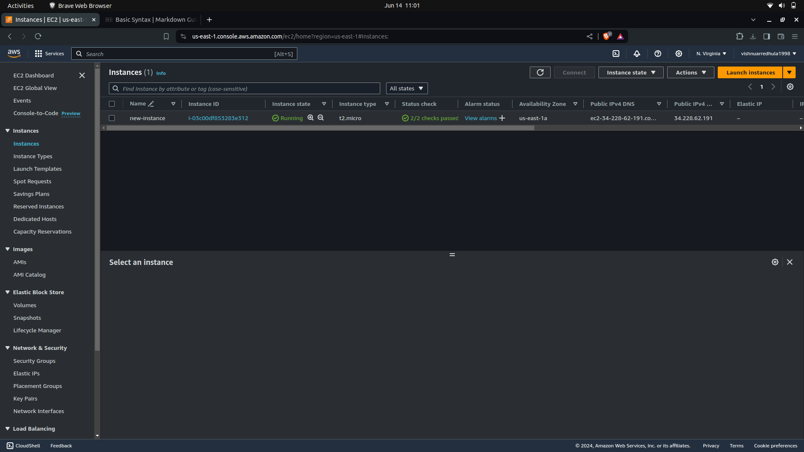
8. On clicking on the instance id we can view all the details regarding the instace. We can have the public and privare ip address which can be used to access ec2 from out of the world or from aws network
   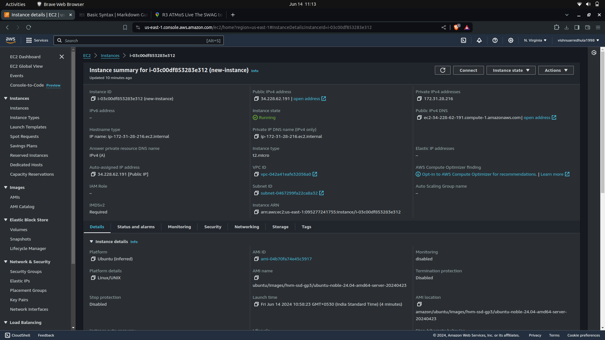

### Login to ec2

1. Copy the public IP address
2. Go to terminal and write the command below

```
ssh -i aws-login.pem ubuntu@34.228.62.191

```

3. Break down the command 'ssh' is command used to login -i and using the private key ubuntu is the username and with public IP address.
4. After clicking enter with the command we will get the error as below type yes
   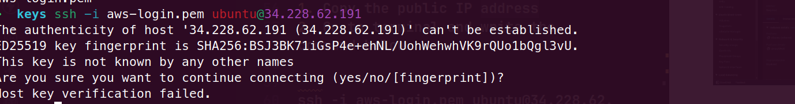
5. Need to change the permission for the pem file as below

```
chmod 600 file.pem
```

6. After running the command we can see something as below logged in to the ec2 server
   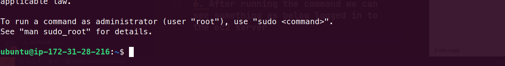
7. We can change the user to root by running the below command

```
sudo su -
```

8. run logout to get back from root to ubuntu user

```
logout
```

9. First thing need to do is run updates on the VM

```
sudo apt update or apt update
```

8. Deploying simple application. We are going to deploy jenkis. Run the below commands to install

```
sudo apt install openjdk-11-jdk

```

9. To install jenkins we can get it from jenkins website right now we are running the below command which we got from jenkins site

```
sudo wget -O /usr/share/keyrings/jenkins-keyring.asc \
  https://pkg.jenkins.io/debian-stable/jenkins.io-2023.key
echo "deb [signed-by=/usr/share/keyrings/jenkins-keyring.asc]" \
  https://pkg.jenkins.io/debian-stable binary/ | sudo tee \
  /etc/apt/sources.list.d/jenkins.list > /dev/null
sudo apt-get update
sudo apt-get install jenkins
```

10. We can java and jenkins installed and up and running using below commands

```
java --verison

systemctl status jenkins
```

11. Now we will try to access jenkins using our public IP in browser as below

```
http://publicIP:port
```

12. By default the jenkins will run on 8080
13. Here we will not be able to access to application as the security groups for the ec2 is not set
14. The security group is something which sets the inbound and outbound traffic rules for the ec2
15. We will open port 8080 for inbound and access the application as below
16. open the instance and click on security
    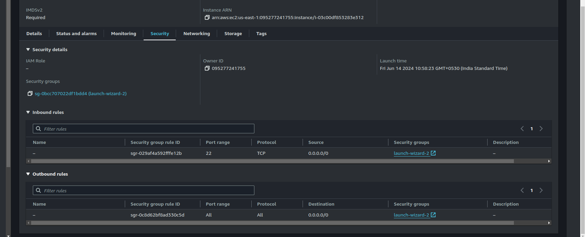
17. Click on the security group id as below
    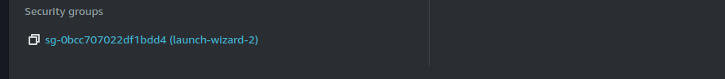
18. Here we can see only one inbound rule is set i.e., for ssh only we need to keep custom tcp for IP4 and open the port 8080 to access the jenkins application through browser
19. Click on edit inbound rules
    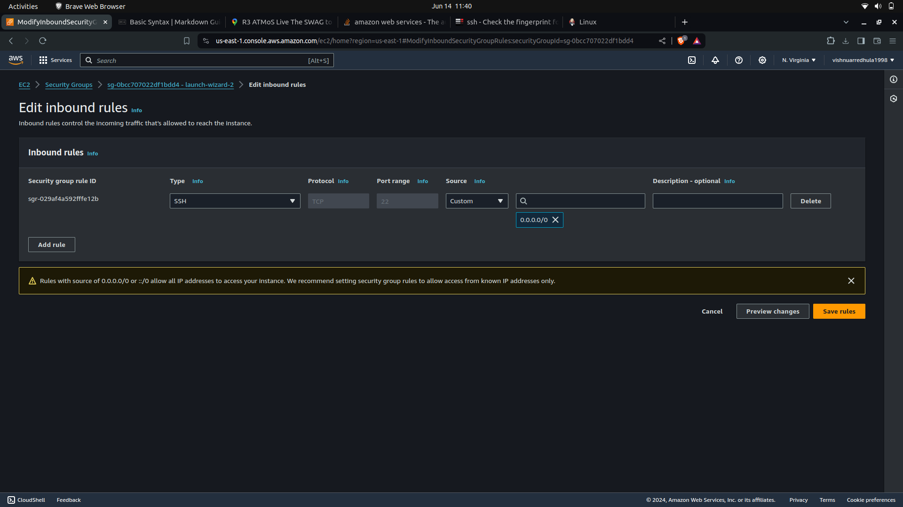
20. Click on add rule and select custom tcp and 8080 port to expose, select source anywhere ipv4 and save it
    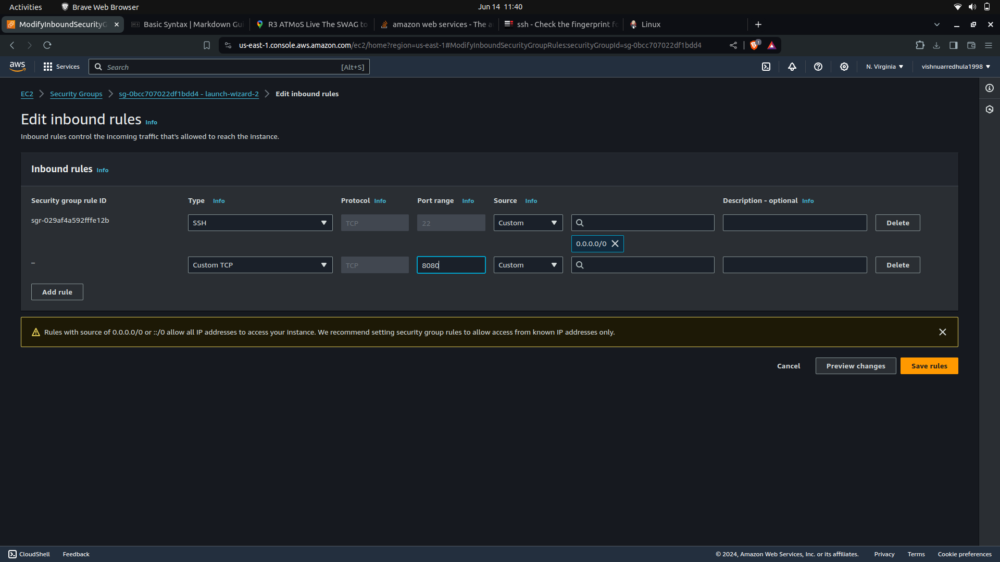
21. After changing rules we can see that jenkins is accessible with link above as shown below uimage
    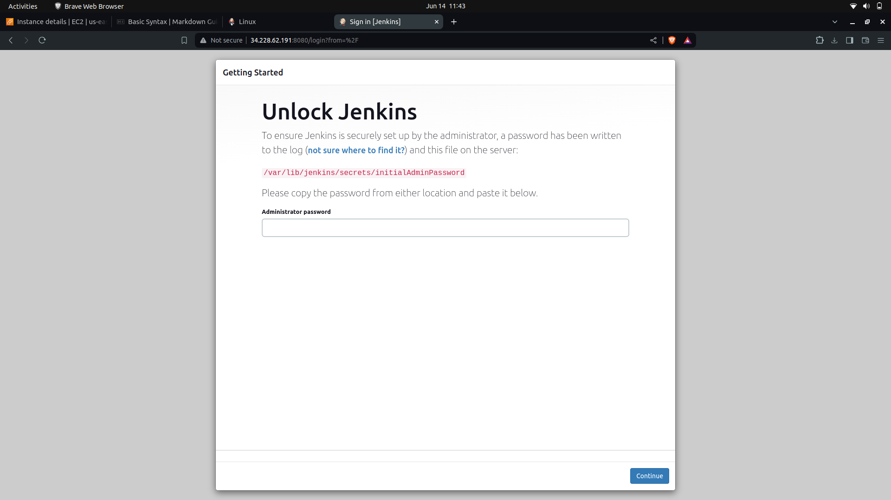

22. To login to jenkins we will use the password with below command

```
sudo cat /var/lib/jenkins/secrets/initialAdminPassword
```

23. Now we can paste the password which we get from terminal to jenkins and the jenkins will be accessible
    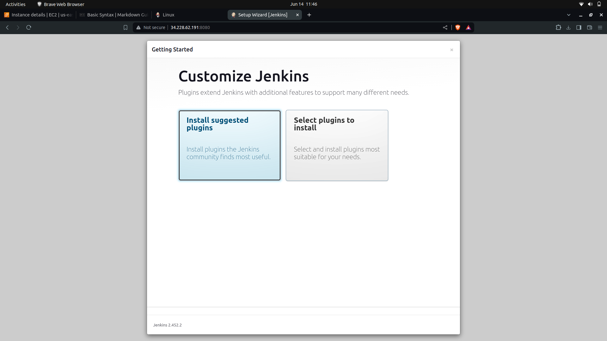
24. stop and terminate the instance after usage
