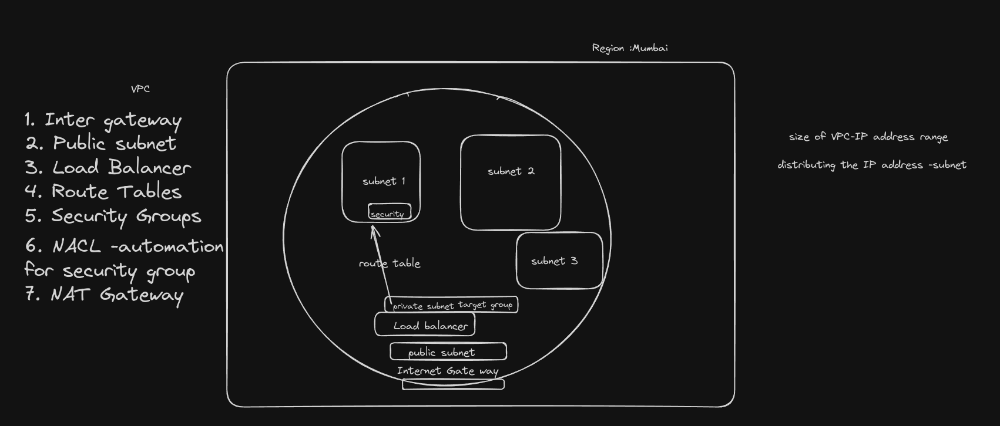
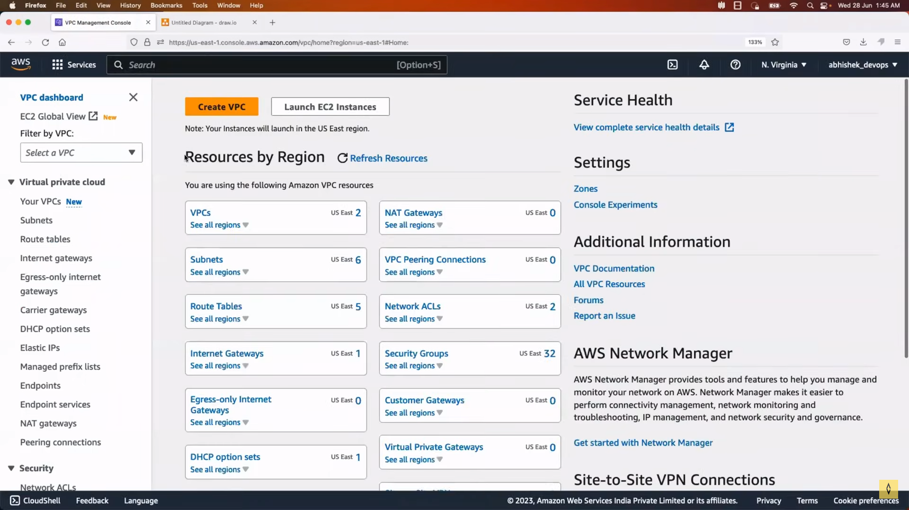
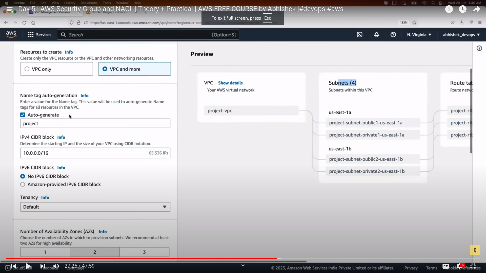
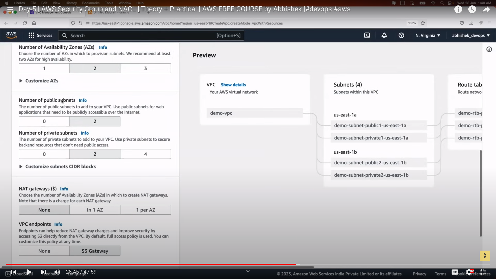
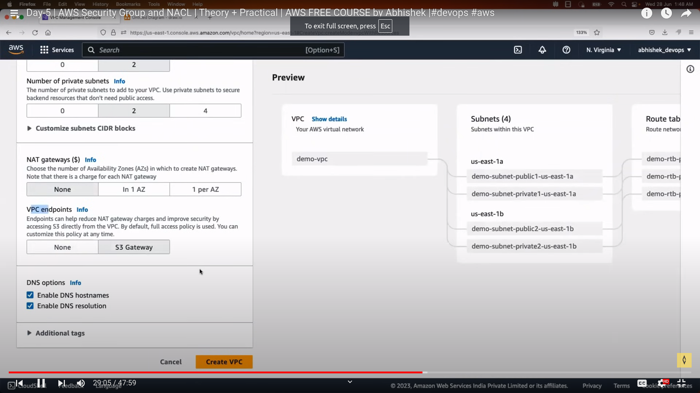
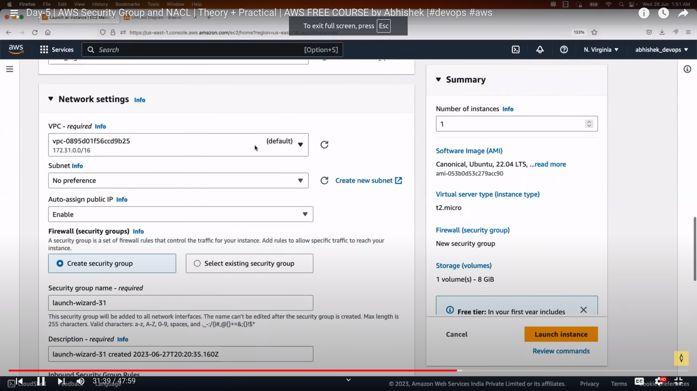
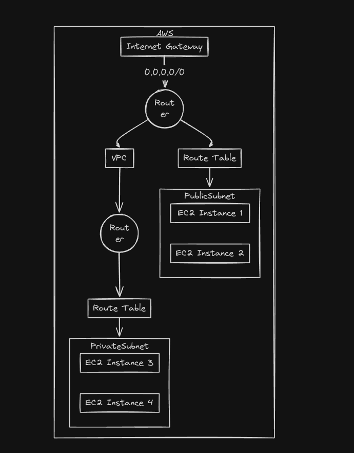

# Virtual Private Cloud (VPC)

## What is VPC

When we created VM is in cloud like aws if any VM which is in same server is compromised because of a hacker then the VM which is in same server can be vulnerable for the attack, Thats why we have VPC Virtual Private Cloud which adds an extra layer virtually to make it more secure with more complex systems

## Why is VPC

To avoid security breach and make the data confidential in public cloud we are moving to VPC

## Flow of VPC

Below is the flow of VPC

1. Size of VPC = IP address range , we can select it
2. subnet- Distribution of IP Address
3. Lets say we have a region with availability in this we want to create VMs
4. First we will make the VPC with the range of IPs and in that we will divide the private and public subnet in accordance to our projects
5. In the subnets we can have the VMs.
6. The VPC will have a internet gateway any request should pass the internet gateway
7. After that the public subnet is available, The public subnet is something the public request can see.
8. Then the load balancer will be there which routes the request according to the laod
9. Load balancer doesnt know where to route it will have only target group.
10. The route table will help the load balancer to reach its target
11. The security groups are available at VM level which will check the req can be sent in or not
12. Then we the nat gate way which will mask our IP when we try to access internet from VM
13. NACL is something which automates the security group process. NACL is adding security at subnet level

14. Security group is **Instance Level**
15. NACL is at **Subnet Level**

    > Note : Security is shared responsibility

16. Security Group has two types
    a. Inbound- flows in to app
    b. Outbound- flows out from app

17. Default - outbound is not allowed except port 25(mailing service)

18. **NACL** (Network Access Control List)
19. We can define what kind of req we want to deny can be defined in NACL at subnet level/ also we can use NACL for automation
20. Security group can only allow traffic
21. In NACL we can do both allow and deny , If we create two rules to allow and deny the rule with lowest order will be executed.

## Creating our own VPC

1. To create VPC login to aws and search for VPC
   
2. Click on create VPC and select VPC and more as AWS will configure the subnets internet gateway , route tables
   
3. Set the subnets,availability zones , we can change the IP address also
   
   4.Create the VPC
   
4. Create the VM now in ec2 , while creating a normal ec2 aws assigns a default VPC but we need to select our own VPC, change VPC and
   select the subnet preference u can choose private or public public can be accesible through internet
   
5. Here we can do ssh to our VM and run the app at a particular port and allow the port in security group. The application will work
6. IF in the NACL the rule is set to deny the request then we cannot access the app as the NACL comes first then the security group
   
