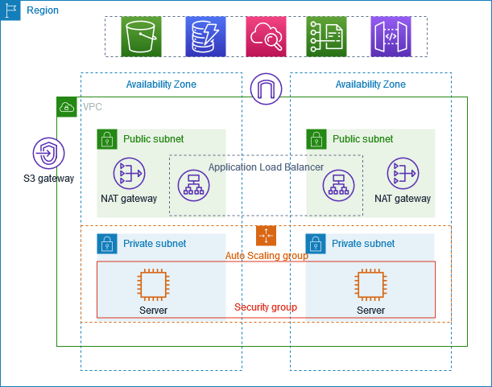

# VPC with public private subnet



## Auto scaling group

we can add min of servers and tell auto scaling groups when there is increase in traffic to scale up the server to 'x'

## Load balancer

It takes the traffic and balances the traffic between the server

## Bastion /Jump server

As we cannot ssh to VMs in private subnet we will create the VM in the public subnet and use that to do operations in private subnet

## Flow up with prod VPC

1. Create the VPC as per last VPC ref and change one thing NAT gateway select 1 per AZ
   and s3 vpc end point can be disabled (s3 is optional)
2. If this throws error for elastic IP search for elastic IP and release it.
3. VPC uses the elastic IP address to mask the private subnet IP with public IP when using internet to protect it
4. NAT gateway is chargable.
5. Now search for ec2 and in the side bar u will find the auto scaling groups
6. create autoscaling group.
7. create the lanch template , give it a name and description select the OS and instance type and key value pair and select create a new security group , give it name and description and select the VPc we just created add inbound rules add what needs to be exposed (open ssh port)
8. Create another security group rule 2 to expose the port which the application will be running and click on launch template
9. After creating template come to auto scaling group and give it a name and select the launch template u have created and click on next and select the VPC created and select the private subnet for availability zones and subnets
10. click on next desired capacity , minimun capacity and maximun capacity ... in desired it will start with desired , when traffic is less it moved to minimum and when traffic is moreit moves to maximun capacity.
11. In the scaling policy click on none for now (read in docs)
12. Click on next we can also add noticiations(if needed) and click next
13. Check in EC2 that autoscaling group have created the VMs in the AZ or not.
14. We need bastian server to login to the created ec2 as they do not have public IP
15. Create a new VM with created VPC, auto assign public IP (must) and launch instance
16. copy the pem file to baston server as from that we need to ssh to private subnet instances

```
scp -i filepath filepath ubuntu@publicIP:path
```

17. Now SSH to the bastion host and login to any VM from private subnet using same ssh command
18. Install a simple app and run it in any port say 9000 port

```
python3 -m http.server 9000
```

19. Create load balancer and attach target groups
20. Go to load balancer and click on application load balancer (it does http and https load balance (L7))
21. Give it a name select internet facing and public subnet IPv4 select , select the created VPC select bothe availability zones with public subnet, select the security grop of VPC if it doesnt work we can new one or modify

22. In listenerss and routing click on create target group
23. select instances in target group give it name select the VPC it should be http for now click on next and select the ec2 instance in private subnet ( select the port in target group in which the application is running in the ec2 VM)
24. click on include as pending and create target group
25. come to load balancer again and add the created target group and in the listener and routing select port according to it 80
26. create the load balancer
27. If we cant access load balancer check security group and change inbound rule
