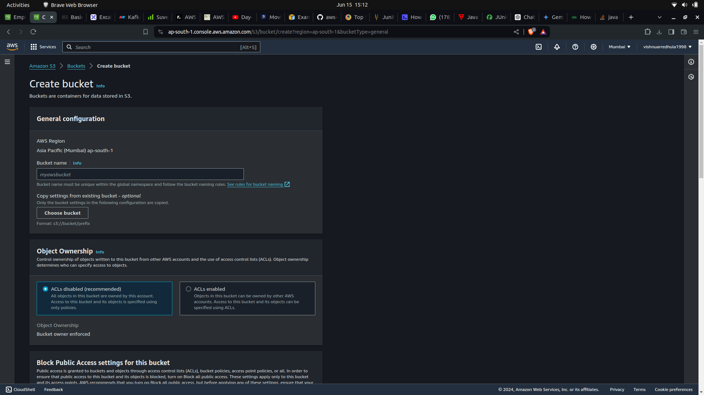
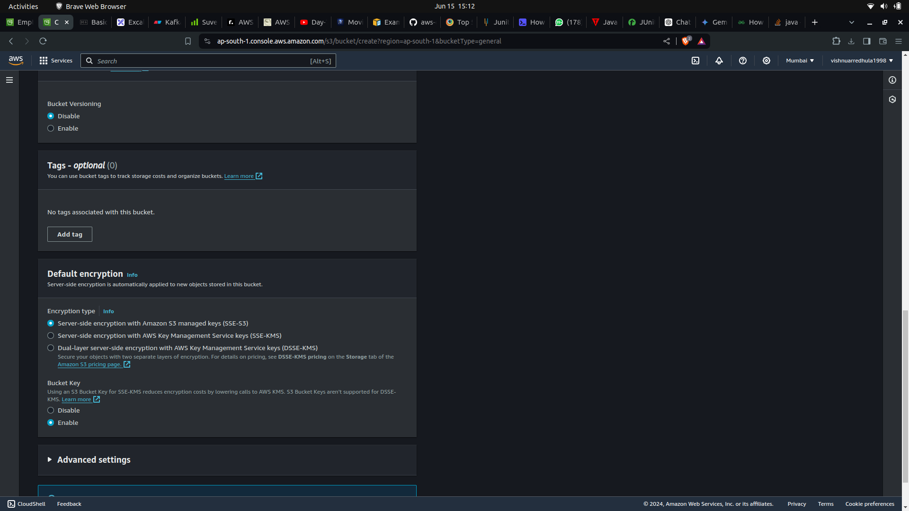
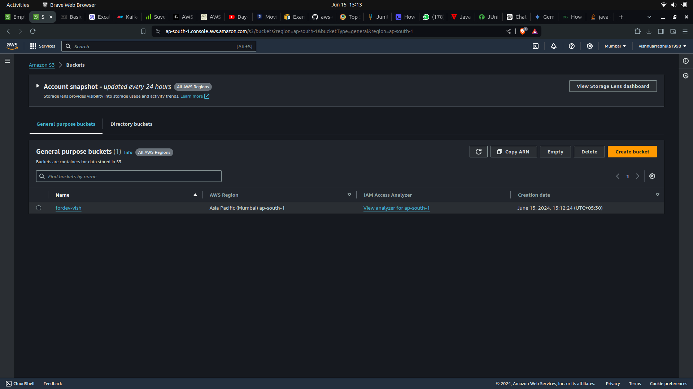
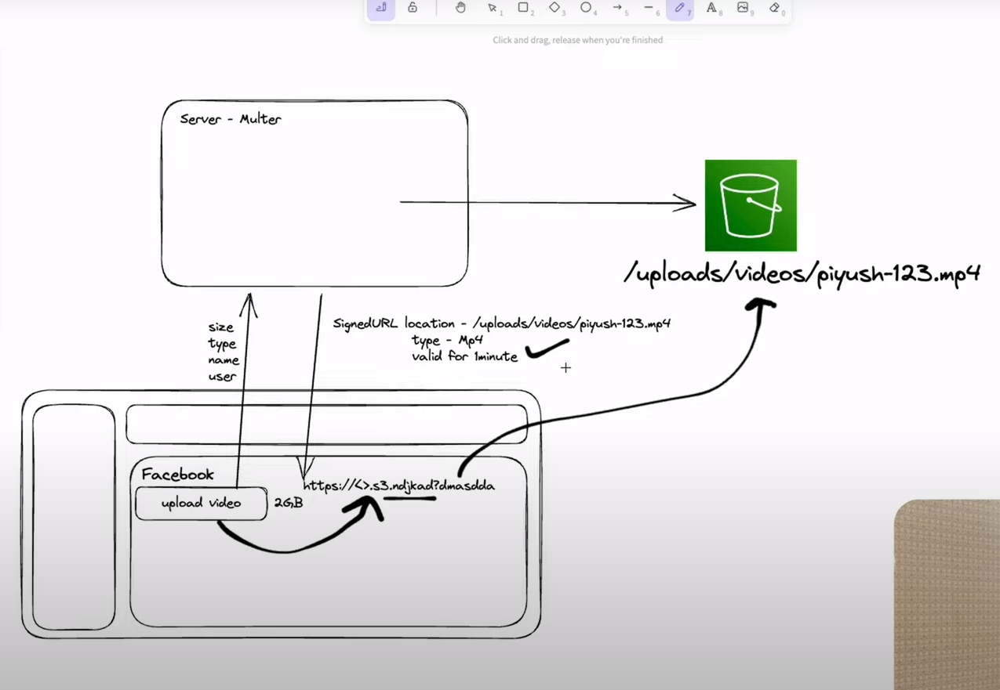
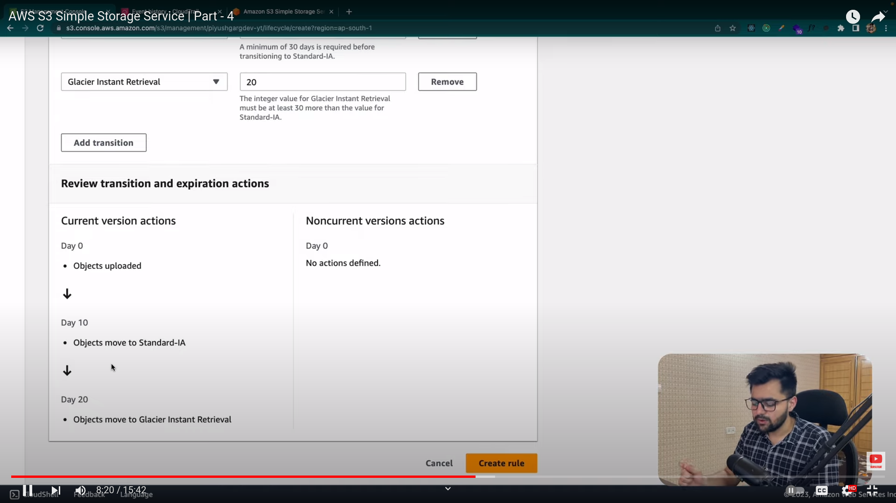

# S3 for DEv

### Imp

1. S3 has buckets and objects
2. every bucket has its own policies and cors
3. S3 bucket name should be unique globally
   
   
   
4. In aws everything is an API call
5. We need presigned url to operate anything on bucket from api level
6. For every operation s3 it creates a token to do the operation by checking the access
7. Even if we unblock public access no one can access the bucket objects from the url because we need to write policies for read access to the bucket
8. The presigned is built using the access token of the IAM user, The IAM user must have the access to s3 to get or put object to S3
9. There are two things in presinged url 1. PUt object 2. get Object
10. To access through node js we need to give console access
11. Create a IAm user with s3 access and create access key for that copy access key and secret key which we can use in the code

```
import {
  S3Client,
  GetObjectCommand,
  PutObjectCommand,
  ListObjectsV2Command,
  DeleteObjectCommand,
} from "@aws-sdk/client-s3";
import { getSignedUrl } from "@aws-sdk/s3-request-presigner";

const s3Client = new S3Client({
  region: process.env.REGION,
  credentials: {
    accessKeyId: process.env.ACCESS,
    secretAccessKey: process.env.SECRET,
  },
});

async function getObjectURL(key) {
  const command = new GetObjectCommand({
    Bucket: process.env.BUCKET_NAME,
    Key: key,
  });

  const url = await getSignedUrl(s3Client, command);
  return url;
}

async function listObjects() {
  const command = new ListObjectsV2Command({
    Bucket: process.env.BUCKET_NAME,
  });

  const result = await s3Client.send(command);
  console.log(result);
}
async function deleteObject() {
  const command = new DeleteObjectCommand({
    Bucket: process.env.BUCKET_NAME,
    Key: "video_720p.mp4",
  });
  await s3Client.send(command);
}
async function init() {
  // console.log("url for video", await getObjectURL("video_720p.mp4"));
  //   console.log(
  //     "URL for uploading",
  //     await putObject(`image-${Date.now()}.jpeg`, "image/jpeg")
  //   );
  //await listObjects();
  await deleteObject();
}

async function putObject(filename, contentType) {
  const command = new PutObjectCommand({
    Bucket: process.env.BUCKET_NAME,
    Key: `/uploads/user-uploads/${filename}`,
    ContentType: contentType,
  });
  const url = await getSignedUrl(s3Client, command);
  return url;
}

init();

```

#### Upload from client to s3 with presigned url

Some time when we have a file which huge in data size then it is not good to send to server and upload it from there . Then we will send the metadata from client to server when the client clicks on upload then we will generate a presigned url from server with that presigned url the user can upload the file directly from client to s3 . The url will work for only some time.



### Cloud Trail in s3

    Maintains the log of s3 bucket

### Event Notifications

    when ever some (specific operations (used specified)) done in s3 we can trigger things like lambda functions

### CORS

### Life cycle rules

In life cycle we can define what can be object done after certain days like moving it to lower storage or deleting it


### Replication rules

we can replicate rules from one bucket to another bucket

### Inventory configuration

for monitoring : it keeps track of objects in bucket and creates a json for every user defined stipulated time
