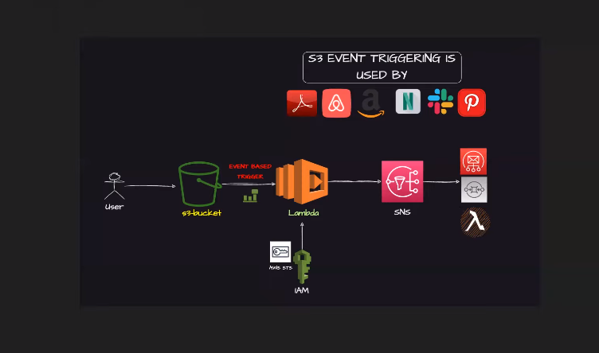

# SNS Project (Event triggering)

### Flow



### Steps

1. Configure the aws cli and run the below shell script

```
#!/bin/bash

set -x

# Store the AWS account ID in a variable
aws_account_id=$(aws sts get-caller-identity --query 'Account' --output text)

# Print the AWS account ID from the variable
echo "AWS Account ID: $aws_account_id"

# Set AWS region and bucket name
aws_region="us-east-1"
bucket_name="abhishek-ultimate-bucket"
lambda_func_name="s3-lambda-function"
role_name="s3-lambda-sns"
email_address="zyz@gmail.com"

# Create IAM Role for the project
role_response=$(aws iam create-role --role-name s3-lambda-sns --assume-role-policy-document '{
  "Version": "2012-10-17",
  "Statement": [{
    "Action": "sts:AssumeRole",
    "Effect": "Allow",
    "Principal": {
      "Service": [
         "lambda.amazonaws.com",
         "s3.amazonaws.com",
         "sns.amazonaws.com"
      ]
    }
  }]
}')

# Extract the role ARN from the JSON response and store it in a variable
role_arn=$(echo "$role_response" | jq -r '.Role.Arn')

# Print the role ARN
echo "Role ARN: $role_arn"

# Attach Permissions to the Role
aws iam attach-role-policy --role-name $role_name --policy-arn arn:aws:iam::aws:policy/AWSLambda_FullAccess
aws iam attach-role-policy --role-name $role_name --policy-arn arn:aws:iam::aws:policy/AmazonSNSFullAccess

# Create the S3 bucket and capture the output in a variable
bucket_output=$(aws s3api create-bucket --bucket "$bucket_name" --region "$aws_region")

# Print the output from the variable
echo "Bucket creation output: $bucket_output"

# Upload a file to the bucket
aws s3 cp ./example_file.txt s3://"$bucket_name"/example_file.txt

# Create a Zip file to upload Lambda Function
zip -r s3-lambda-function.zip ./s3-lambda-function

sleep 5
# Create a Lambda function
aws lambda create-function \
  --region "$aws_region" \
  --function-name $lambda_func_name \
  --runtime "python3.8" \
  --handler "s3-lambda-function/s3-lambda-function.lambda_handler" \
  --memory-size 128 \
  --timeout 30 \
  --role "arn:aws:iam::$aws_account_id:role/$role_name" \
  --zip-file "fileb://./s3-lambda-function.zip"

# Add Permissions to S3 Bucket to invoke Lambda
aws lambda add-permission \
  --function-name "$lambda_func_name" \
  --statement-id "s3-lambda-sns" \
  --action "lambda:InvokeFunction" \
  --principal s3.amazonaws.com \
  --source-arn "arn:aws:s3:::$bucket_name"

# Create an S3 event trigger for the Lambda function
LambdaFunctionArn="arn:aws:lambda:us-east-1:$aws_account_id:function:s3-lambda-function"
aws s3api put-bucket-notification-configuration \
  --region "$aws_region" \
  --bucket "$bucket_name" \
  --notification-configuration '{
    "LambdaFunctionConfigurations": [{
        "LambdaFunctionArn": "'"$LambdaFunctionArn"'",
        "Events": ["s3:ObjectCreated:*"]
    }]
}'

# Create an SNS topic and save the topic ARN to a variable
topic_arn=$(aws sns create-topic --name s3-lambda-sns --output json | jq -r '.TopicArn')

# Print the TopicArn
echo "SNS Topic ARN: $topic_arn"

# Trigger SNS Topic using Lambda Function


# Add SNS publish permission to the Lambda Function
aws sns subscribe \
  --topic-arn "$topic_arn" \
  --protocol email \
  --notification-endpoint "$email_address"

# Publish SNS
aws sns publish \
  --topic-arn "$topic_arn" \
  --subject "A new object created in s3 bucket" \
  --message "Hello from Abhishek.Veeramalla YouTube channel, Learn DevOps Zero to Hero for Free"

```

2. After running you will get a new mail to your mail id to accept the subscription froma aws

```
import boto3
import json

def lambda_handler(event, context):
    # Extract relevant information from the S3 event trigger
    bucket_name = event['Records'][0]['s3']['bucket']['name']
    object_key = event['Records'][0]['s3']['object']['key']

    # Perform desired operations with the uploaded file
    print(f"File '{object_key}' was uploaded to bucket '{bucket_name}'")

    # Example: Send a notification via SNS
    sns_client = boto3.client('sns')
    topic_arn = 'arn:aws:sns:us-east-1:<account-id>:s3-lambda-sns'
    sns_client.publish(
       TopicArn=topic_arn,
       Subject='S3 Object Created',
       Message=f"File '{object_key}' was uploaded to bucket '{bucket_name}'"
    )

    # Example: Trigger another Lambda function
    # lambda_client = boto3.client('lambda')
    # target_function_name = 'my-another-lambda-function'
    # lambda_client.invoke(
    #    FunctionName=target_function_name,
    #    InvocationType='Event',
    #    Payload=json.dumps({'bucket_name': bucket_name, 'object_key': object_key})
    # )

    return {
        'statusCode': 200,
        'body': json.dumps('Lambda function executed successfully')
    }
```
